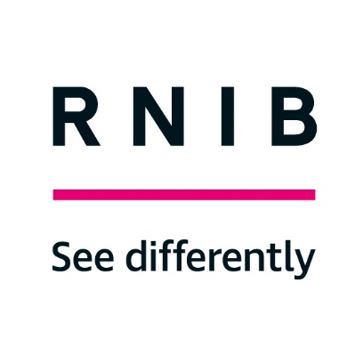

# RNIB Best Practice in Accessible Gaming 2024 [BPAG2024]
## 1	Spectrum of sight loss 
People with sight loss cannot be thought of as one homogenous group. People have different levels and types of sight loss, and their level of sight will decide how they interact with content. People with significant sight loss who are generally registered as severely sight impaired have different requirements to those of people who are partially sighted. 

RNIB has an a-z of sight conditions but some of the most common are:
1.	[Glaucoma](https://www.rnib.org.uk/your-eyes/eye-conditions-az/glaucoma/)
2.	[Diabetes related eye conditions](https://www.rnib.org.uk/your-eyes/eye-conditions-az/diabetes-related-eye-conditions/)
3.	[Cataract](https://www.rnib.org.uk/your-eyes/eye-conditions-az/cataracts/)
4.	[Macular Degeneration](https://www.rnib.org.uk/your-eyes/eye-conditions-az/age-related-macular-degeneration-amd/)
5.	[Retinitis Pigmentosa](https://www.rnib.org.uk/your-eyes/eye-conditions-az/retinitis-pigmentosa/)

## 2	Feedback welcome
We expect the games industry will continue to improve and evolve and we intend that this document should do the same. If you feel any advice is missing, any challenge is not tackled or any common solution is not represented then let us know. This document belongs to the games industry and we will be updating it in line with accessibility best practice.

## 3	The CAPS test
When making a game accessible it’s important to remember that it still needs to be enjoyable. It needs to retain Challenge, Ambience, Participation and Story.
### Challenge
The game needs to challenge a player, or they will lose interest. 
### Ambience
Many games are set in rich worlds. This ambience needs to be communicated to players or they will be missing out on an important feature.
### Participation
If a game allows communication between players, then this needs to be accessible to enable gamers with sight loss to feel included. This includes trophies and the ability to discuss the game.
### Story
Gamers with sight loss need to be able to follow the story so cutscenes, in game exposition and banter between characters needs to be accessible.

If a game can be playable from beginning to end but fails the CAPS test then the game may not be engaging enough for gamers with sight loss. 

## 4	Designing upwards theory
This theory is where we’ll begin as this is a starting point that everything else can feed into as part of implementation. However, we also understand that there are limitations to being able to implement accessibility so every approach might be different (for instance due to engines not allowing for easy building in of menu narration) which could change as projects progress.  Identifying these barriers and the right people who can assist in solving them can then allow future projects to have accessibility built in from the ground up as early as possible in development, thus not incurring retrofitting costs. Any serious barriers should be recorded on a centralised document. This means that if a developer has resources, then they can appoint a separate team or member of staff to resolving them. If not, then they can seek to fix them with any spare staff capacity between projects. This list should be as centralised as possible so that if teams working on separate projects face the same issue it can be fixed once and benefit both projects. 

Gamers across the spectrum of sight loss should be able to enjoy the same titles as everyone else, including players with absolutely no sight whatsoever. The features that can be of assistance, (menu narration, use of haptics for information etc) will not only assist blind players but anyone with greater levels of usable vision as well as other challenges (for instance if they can’t hear a cue that has a haptic equivalent).

If you instead were to design features for people with usable vision (colour-blindness/contrast filters for instance) you’d have the issue that only those who can see at that level of vision or above are having improved agency, whereas anyone who has less vision can’t benefit from those elements.

As a result, you should look, where you can, to design upwards from no vision whatsoever so that as many people as possible can benefit.
As an underlying principle, any information that needs to be communicated should be communicated with high contrast visuals, through audio and preferably through a text free option. This should help blind and partially sighted people and anyone who is reading impaired including people with dyslexia or with English as a second language (including many sign language users). Multimodal communication (communicating visually and audibly at the same time) is often preferable but whether to communicate something with ‘standard’ visuals, high contrast visuals or audio can be a choice delivered through the settings menus. 

Colour coding is a good way to communicate information, but it should not be the only mechanism used because it may be inaccessible to people who are colour blind. 

Consider where accessibility can be the default. A good example is using sound design to communicate information. If a player can tell what type of attack is coming (high, low, unblockable etc) from the sound it makes then a blind player can react accordingly without having to change any settings. This simplifies menus, gives blind players a better experience and may even benefit sighted players who don’t realise that they are also reacting to the audio as well as the visual information.

## 5 The Value of Agency

During accessibility discussions, it is always important to consider how much agency a player has via particular accessibility implementations.  Agency here is defined as how much a player can achieve without the need for additional workarounds, whether they be technological (such as Optical Character Recognition or OCR) or human (i.e. getting a sighted person to assist verbally via callouts or through controlling the game for them).

Agency has become a key point of discussion over the last few years, with players repeatedly stating that they want to be able to actually engage with the game, not just listen to it essentially playing itself.

### 5.1 Targeting/Aiming
The process of hitting your target first begins with you actually being able to target it correctly.  In years gone by, it was customary to utilise a lock-on mechanic to keep a target in the centre of your view, or even hit it directly when a player pressed the corresponding button to fire their weapon of choice.

Even in titles like The Last Of Us Parts I and II, as well as God Of War Ragnarök, though a player can freely aim, without sight it is often recommended to just use target lock or the game's equivalent setting to be able to guarantee hitting your targets.

This system, as much as it can allow for progression, does not unfortunately provide a great deal of agency.  For example, all you have to do during a Last Of Us encounter is to aim, wait until an enemy is in range (as the game tracks targets for you and locks onto them automatically) then pull the trigger until the target dies, then wait for the next enemy to appear and repeat until you clear the area.

An alternative for this has thankfully been seen in recent years thanks to titles like Sea Of Thieves, where audio aim systems mean you can hear where a target is and adjust your weapon's reticle/crosshair accordingly based purely on changes in the audio cues presented.

Such systems mean that it is solely up to the player as to which target they shoot first, let's say, rather than having a lower priority target in your sights instead of the main threat.

**To Add:**
- Blind people want to play the game not listen to it play itself,
- Audio Aim vs Auto Aim,
- Don't skip mini games,
- Audio beacons for navigation rather than rails
- Removing agency decreases the challenge and enjoyment of a game
- Making the game playable is the main option so it's better to skip a section (or feature) and have the rest of the game playable than obsess over a minigame

## 5	Platform specific requirements 
The accessibility needs of users do not change much depending on platform but the tools available may do. These may also create situational accessibility needs. If a web-based game can be played through a PC browser or a mobile phone, then the size of onscreen text will need to be larger for the mobile phone in proportion to the screen size. The gamer using a mobile phone could be considered situationally partially sighted because they will face much of the same challenges as a partially sighted gamer may face using a larger screen.

### 5.1	PC/Mac/Web based
Windows and OSX have screen readers that will read out highlighted text and magnification software that will enlarge a portion of the screen. Depending on the development environment you use you may be able to make use of the screen reader to read out menus or magnify part of the screen. 

PC gamers and Mac gamers may use magnification software to zoom in to games. This may be useful for menus or in game text where a game does not require a timely response. For high levels of magnification it is important that menus have a logical layout otherwise users may not be able to find menu options.  

### 5.2	Mobile phones and tablets
Mobile phones provide both challenges and accessibility tools. A smaller screen means that accessibility tools for partially sighted people are even more important because more people may need to use them. 

Larger mobile phone operating systems include suites of accessibility tools as standard. Screenreaders, magnification, high contrast modes, colour inversion and colour vision deficiency filters are common and whether you can make use of these will depend on the development environment   you choose. For instance, the native development environments for particular platforms may provide better access to accessibility frameworks than cross-platform development tools. When selecting a development environment find out how much it allows use of the accessibility frameworks available and how much you will need to do yourself. Tools such as magnification and colour inversion will likely work regardless of the development environment you choose so it is worth testing with these to see how well they work with your game and whether you can do anything to improve the experience.

### 5.3	Consoles 
Consoles have a rich selection of options for input and output. For output, consoles often allow for large screens, immersive soundscapes (through headphones or speaker arrays), and tactile feedback through controllers. For input, they may have buttons, joysticks, d-pads, microphones, cameras, accelerometers and motion sensors. All of these have accessibility potential but could also raise accessibility barriers.  

## 6	User-interface navigation
There are three primary ways to do this:
-	By voice: Narration
-	By vision: Magnification/ Zoom
-	By touch: Haptics

### 6.1	Menu/UI Narration  
Menu and User Interface (UI) narration, hereafter simply referred to as “narration”, is a feature that allows menu items and other elements in a game to be spoken, primarily via synthesised speech.  This means that those with no vision or who have trouble seeing the screen for whatever reason can navigate menus unaided. 

#### 6.1.1	Adjustable Speech
Narration as defined above should be adjustable in terms of its speed.  After all, just like we all read at different paces, we also all listen and comprehend at different rates.  If a player needs information quickly and can understand the speech at a much faster rate, they should be able to speed up the rate at which the narration is being spoken. Many screen reader users will listen to speech at over 300 words per minute [^1] and sometimes as fast as 500 words per minute. With the range of variability between users it’s best to offer as much granularity in speeds as is practical.
Examples: Diablo IV, Sea Of Thieves and any game that has screen reader compatibility on PC

### 6.2	DPad navigation
Allowing players to use digital directional movement as opposed to a cursor-based system will not only allow gamers across the spectrum of sight loss to more efficiently navigate menus, maps and other elements, but also assist those outside of that demographic who have issues with cursor-based menus.

Accessing menu and interface elements using free moving cursers can cause problems for people with sight loss or dexterity issues. Blind users have no context for where a free moving curser is until it hits an interactive element (and that’s only if the element has an audible or tactile cue). If your game is accessible through magnification, then users with high magnification settings may also find they are lost with no visual markers near enough to the curser to tell them where they are. Users with dexterity issues or non-standard input devices may also have trouble with the precision of landing on an element.

Enabling a user to move between items with a single button press can help in all these areas. In a menu, feedback to the user should also give enough context to navigate. Speech should make it clear when the user is on a submenu and what type of control is highlighted. Toggles, sliders and radio buttons have different behaviours when selected and a blind user needs to know which one they are using. This could be explicitly stated in the speech by saying “toggle”, “slider” or “radio button” or indicated some other way as long as it is clear and consistent.

### 6.3	Aiming 
If your game requires use of a reticle for aiming, for whatever purpose (i.e., even if your game is not combat-focused), though lock-on aiming is an option, explore the possibilities of utilising audio and haptic feedback to allow players with no sight to aim with more freedom and know what they’re targeting.  For instance, in a target rich environment where differing enemies can take priority, allow players to distinguish what enemy they want to lock onto and target.

An example of an audio-based aiming system can be seen in Sea Of Thieves’ August patch in the form of aim assist audio cues.  These allow a player to line up a target in the sights of their guns and fire when a different audio cue, indicating successful acquisition of the target is confirmed. 

### 6.4	Designing for Zoom  
Zoom is a feature that takes a section of the screen and enlarges it so that it fills the whole screen. It makes images bigger which can help partially sighted people but since it is only showing part of the screen it means the rest of the screen will not be visible. It also requires a separate navigation mechanism to choose which part of the screen you want to see. You might build zoom into your game, especially if the gameplay is turn-based rather than real-time but some platforms will enable zoom even if you do not build it in itself. Zoom functions can often magnify screens up to 16 times and, in the case of specialist software, even up to 64 times. 

If you decide to build zoom in yourself then it is worth speaking with accessibility consultants or magnification users to understand common interaction patterns for zoom software. Creating your own zoom will allow you to follow the focus with the zoomed area. Coupled with d-pad navigation this can make it easier to follow menus. 

A much simpler option however is to try to ensure your game works well with the Zoom options that the platform provides. When zoomed in the user is viewing the screen through a small window so it can be easy to lose navigational context. Try to make the layout of menus etc logical and predictable. Left align options that are above each other and avoid putting options in ‘islands’ with no other options or text near them. If an option is separate from the rest of the on-screen information then you can use ruled lines above, below or to the side of it to tie it in with some other text on the screen. 

## 6.5	Scalable user interfaces
A well designed and informative user interface (UI) plays an important role of conveying information to the player. However, the size and placement of UI elements can present accessibility barriers to low vision players. 

Small UI elements are a common accessibility issue for low vision players. For desktop and mobile gaming the minimum target size is 32 x 32 pixels and it is recommended that clickable elements are at least 44 x 44 pixels . Scalable user interfaces, however, can resolve this across all platforms. Allow the player to increase the size of UI elements to make them more readable during gameplay. If there is a maximum value at which the layout and functionality are maintained, consider allowing the player to increase the UI scale beyond this. Though this may cause UI elements to overlap and some useful information to be lost, these increased UI sizes may be useful to some low vision players. 

Allowing the player to adjust the scale and position of individual UI elements is another way to improve their readability by low vision players. Including this level of customisation allows players to enlarge and increase the visibility of UI elements they find most difficult to see without increasing the size of less useful elements or those for which no scaling is needed. 
Examples: Warframe, Tom Clancy’s The Division 2

## 6.6	High contrast filter
Low vision players may find it difficult to distinguish key elements such as interactive objects or non-player characters from the rest of the environment. This can be addressed by implementing a high-contrast mode in which the game environment and other static objects are displayed in a greyscale colour palette, while important or interactive objects are displayed in bright colours that stand out to low vision players. 

Consistent colour-coding of game elements with similar properties can be used to further help low vision players. For example, representing all hazards as red allows the low vision player to quickly identify them in the environment. This can be done through coloured outlines or halos or the whole object can be coloured as a block. Players should be given options to which colours are used so that they can choose those that best suit their vision. Allow a lot of variance in the colours available. Green and red are typically used for safety and danger but red/green colour vision deficiency is one of the most common types so if you just allowed different shades or green and red then they may not stand out to some people.

Sometimes buttons and icons may not be clickable but may still be visible on the screen. The button may be greyed out or be superimposed with a clock face or other modifier to signify that it’s not available. Common options for this are:
- Active (ready to use)
-	Inactive – charging (timer)
-	Inactive – waiting for condition
-	Unavailable

It is recommended to create icons with abilities that display states with different shape, colour and another visual cue. An option needs to be provided to players to help them choose to further enhance the colour contrast and increase the width of shapes.

## 6.7	Colour Vision Deficiency filters
CVD (Colour Vision Deficiency), otherwise known as colour blindness, is a condition where parts of the eye that discern colours are missing or not working as standard. CVD filters, using a process called daltonization, applied across the whole game can ensure that colours have as much contrast as possible and can make the game easier to play for people who have CVD. This can make colours look unnatural and make the game less immersive and as a result, not all players who could benefit from the feature will choose to use it. Using patterns or high contrast ratios (as defined by WCAG) can improve the default accessibility without reducing immersion and offering colour options for some game elements while retaining expected colours (trees are green, concrete is grey, etc) is likely to be the best solution. 

## 6.8	Large text size with clear, readable font/readable text
On-screen text can be a barrier to low vision players being able to play or access all parts of a video game. 

Text that is too small for the low vision player to read will cause those players to either strain to read it or miss it entirely. This can be addressed by making the default text size large enough for low vision players to read comfortably, or by giving the player the option to make the text larger. 

Text size is important, but large text with poor readability can also be a barrier to low vision players. Use a clear, wide font like Arial or Verdana, and avoid using ornate, cursive, narrow or otherwise difficult to read fonts. If a more decorative font is used, then there should be an option to revert to a simpler more readable font.  

Use both upper-case and lower-case letters where possible. Using only upper-case letters works well for titles or main headings, but it will have a significant negative impact on the readability on longer sections of text. The shape of words (i.e., when bits of letters stick up or hang down from the word) gives usable information for partially sighted people to recognise the word. Block capitals have a rectangular shape which makes them harder to read.

The contrast between text and background affects how easy it is to read. Avoid overlaying text on images or video without a contrasting box behind them and provide options for this background to be opaque (or make it opaque by default). The WCAG guidelines have a metric for colour contrast which can tell you how different two colours are.    Allowing the player to choose the text and background colour scheme will make it more accessible to some low vision players.

### 6.9	Flashing, flickering and strobe light effects
Flashing occurs when all the pixels suddenly change to white and reverts back to create a flash, the rate of where flashing occurs is stated between 3-30 Hertz (flashes per second) and in some cases up to 60 Hertz. This is sometimes used to simulate camera flashes or lightning and to indicate that a selection has been made in game menus, but it can induce seizures in people with epilepsy. 

Flashing effects must be avoided by default and if an effect is needed then an alternative that does not endanger people with epilepsy should be used. If it is felt that flashing would have contributed to the game, it needs to be enabled by a user on every session and come with additional advice and agreements to state that the enablement of the feature will not affect them nor any individuals in proximity or within the household.

Flickering and strobe lights can be encountered within game environments and consist of rapid patterned changes of colour and from bright all white to no light being emitted. They have been used in wide range of games that are either set in a space themed horror/thriller or other light ambience in intense game locations. Flickering and strobe lights need to have options that disable the lighting effect and any epilepsy inducing light effects should be disabled on default in the game settings and only be available if enabled by the user.

### 6.10	Standardising the experience across all screens
From the very first onboarding elements, accessibility features such as narration should be present to allow players to set up the game as they desire, without the need for additional assistance. This includes elements such as brightness sliders or screen calibration, which normally appear before any accessibility settings are shown. As demonstrated by God Of War Ragnarök, a voiced prompt could guide the user how to enable narration functionality during set-up.
Examples: The Last Of Us Parts I and II, Gears 5 Horde and Escape modes

## 7	In-game navigation
Games that allow players to explore at will can be hard to navigate for players who cannot see the offered paths easily (or at all). Though some games can allow players to move through the world by pressing a button and have the camera turn, there are also other ways to make this work, including audio cues (see below). Enabling players to roam freely in an open world while still being able to follow both main and side quests is a difficult balance and, at the time of writing this advice, one that has not been achieved to our knowledge. Players will need to be able to select which quest to pursue and the game will need to communicate path markers and quest items appropriately, including ‘hidden’ or discoverable items where the player must find the location themselves. Maps should be made as accessible as possible using contrast, magnification and potentially simplification or colour coding. If a map window tells you information about that region such as which quests and quest objects are available in that region, then this should be read out. 

### 7.1	Audio cues
Audio cues are a key part of gaming with sight loss. They are both the medium in which information is delivered and that the game is experienced and understood. Audio cues should be clear and distinct but should also fit within the game’s universe so as not to break immersion. You don’t always have to use accessibility specific cues either, for instance an enemy’s attack audio could give enough of an audio cue to parry it in an action setting without being able to see it coming and without needing an extra accessibility cue, as can be seen in God Of War 2018 and Star Wars Jedi Survivor  .

Making it clear when a player can do things like jump or traverse or when a status change such as when they are low on health can vastly improve the level of agency a player has and reduce the need for sighted assistance. An accessible mechanism for interrogating status, such as health or ammo, may also benefit gamers.   This should be player triggered and should speak out any important status elements and/or show them with high contrast or magnification. The game may or may not pause on this screen to enable a player to read through or listen to their status without dying. 

Audio cues can also be used for navigation as an alternative to having the camera turn to point the player at the next objective. This gives a greater feeling of space and freedom to the player rather than complete linearity. Examples of this can be seen in Gears 5’s Navigation Ping: Escape Mode feature, which also includes high contrast visual elements to let even more people take advantage of the trail it leaves to lead players through areas.

### 7.2	Audio description
Audio description is a medium that’s long been present in film, TV and theatre, but has only recently become recognised as a core part of the gaming space as of 2020. Though trailers from companies like Ubisoft, Activision Blizzard and Sony Santa Monica are examples of where this has been applied with reference to trailers, videogames still haven’t caught up as of 2023 other than a couple examples, namely The Last Of Us Part I for cinematics and Stories Of Blossom having audio description integrated throughout.

Implementing these to relay descriptions of character actions, gestures or sequences allows players to understand your story where otherwise they will miss key details or plot points.

### 7.3	Descriptions viewable in-game as official channel
If someone can’t see the visuals of the worlds you’ve created, the characters, the locations, the weapons, the items, a lot can be lost in terms of immersion. Having a way to view descriptions of key characters, items, locations etc as a player progresses, as well as audio glossaries for enemies and their attacks, could massively help with the increased level of understanding a player without sight can have of your world. Consider whether information is needed synchronously while a gamer is playing the game or asynchronously through glossaries, bestiaries and other sources of information that a player can look up later. Including artistic context while a player is playing will likely increase enjoyment but full descriptions of environments, enemies, objects, NPCs etc may be better suited to an asynchronous in-game reference.

### 7.4	Haptic feedback 
Haptic feedback from controllers has historically just been used for immersion.  However, recent advances like the PlayStation 5 DualSense haptic feedback capabilities have allowed for increased accessibility-related information to be conveyed.

Used not just for immersion but for information relay (how much health you have, when a bar is filling up for an attack etc). There are currently few examples of best practice, so it is worth testing with users to ensure that mechanics are useful and not distracting.

### 7.5	Cooperative play
The aim of making a game accessible should be to enable a blind and partially sighted person to play it completely independently. The heart of the matter however is to enable a blind and partially sighted player to enjoy the game and allowing cooperative play can do this. This could be where different members of a team take on different tasks such as in Sea of Thieves or where two players could control the same character with a sighted player handling the tasks that require vision such as through the co-pilot system built into Horizon Forbidden West. 

### 7.6	Cross Platform Design 
There are accessibility considerations to keep in mind when designing a game to be released on several platforms. This is particularly important when implementing narration into a game. If one platform is involved, a common strategy is to use a system level output mechanism like Microsoft Speech API (MS SAPI) on Windows, which is a built-in component of the operating system.  However, if available, directly hooking into screen readers (such as on Windows) allows for greater flexibility on the part of the player as their preferred rates of speech, verbosity settings etc could be used or acknowledged by the system as the default.   
 
If you are working with several platforms the system level screen reader requirements can differ and it may not be possible to implement narration across the different platforms with a singular solution.  This means that instead of utilising the platform to provide the text to speech, the designer would have to provide the narration. Using speech synthesis or pre-recorded narration would ensure that the narration would work on any platform. Solutions like Read Speaker’s plug in or in development implementations from engines like Unity or Unreal may be viable alternatives but should be user tested during development to avoid any missing narration or customisability issues being left unchecked until release. 

## Case study: Puzzle games
When deciding what to speak to the user or what to highlight through the accessibility API’s of Android and iOS it is important to think about what information a user needs and prioritise the information they want to hear first. 

A good example of giving users the information they need is Sudoku. Sudoku is a game with a 9 by 9 grid which is broken down into nine 3 by 3 blocks. Some cells in the grid have numbers in and the player needs to put numbers in the other cells so that any particular number does not occur twice in the same row, column, or block. A user needs to know which numbers are in the same row or column as a particular cell and which numbers are present in the block. You could require a user to move left and right to hear which other numbers are present in a row, but this will feel very clunky. You can add a feature to read out the relevant numbers i.e.. “row, 2 5 7, column 5 8 6 1, block 9 6 4 2” which will help for easy sudoku. Some tactics need more information, however. In a row spanning over three blocks where the number 2 hasn’t been filled in and all three of the cells in the centre block are full then if there is a 2 anywhere inside the left block you know that the row in the right block contains a 2. This is because the row must have a 2 in it but the 2 in that row isn’t in the left block (because then it would appear twice in the same block) or the centre block (because there isn’t an empty cell). To enable a screen reader user to use this tactic you need to communicate the information that the centre block is full while trying not to give too strong a hint. The aim of the game is to use logic and screen reader users should be allowed to realise that logic themselves. You could communicate this information by grouping the numbers together with pauses to denote the edge of blocks. If the user is in the left block and hears “row, 3, 4 7 9, 6 5, column, 4, 5 9, 1 3, block, 3 4 8 2 5 7” they then have enough information to deduce that the empty cell in the right-hand block of that row is a 2. They have been given the information to solve that piece of the puzzle but without too heavy a hint (which reduces the challenge) or being required to move all along the row (which needlessly increases the challenge). When deciding what to speak try to include the information players will need for more advanced tactics but without dropping too heavy a hint.

Crosswords are another good example. A crossword is a word puzzle where words need to be placed in rows and columns of cells in a, usually, irregular lattice such that each cell contains one letter and some of the cells will be part of two different words. Rows and columns are usually numbered with a set of clues to solve that will tell you what word is needed for a row or column. As words are placed in the lattice this will inform the user of some of the letters that are parts of other words that the clues indicate. They may read a clue and already know that the second letter is t and the fifth one is r. A user may then want to cycle through the lattice to find words that already have some of the letters filled in. To do this they will want to hear the progress for each word i.e., “6 letters, second letter t, fifth letter r” before having to listen to the clue. Another common tactic after hearing a clue is to get a hint by solving the clue of a word that intersects the one, they want to solve. This means the accessible gameplay should attempt to enable behaviour whereby after hearing a clue a user can then hear the clues to words that intersect the first word, solve these and return to the first word. This may be done with bespoke commands such as “hear intersecting clues” but may also be done by allowing users to move up, down, left and right through the lattice and hearing the clues that apply to a given cell. For instance, when walking through 5 across and landing on an intersectional cell the user could be told it is the third letter of 7 down and be given the clue for 7 down. The user can then keep going left and right to hear more of 5 across or press up or down to move into 7 down. When designing accessibility for puzzle games with common gameplay patterns those gameplay patterns should be accommodated by the accessibility features and design.

## 8	Categorising Mobile Games for Accessibility
### 8.1	Genres vs mechanics
While genres are useful for choosing games to play, they are not always useful for identifying accessibility challenges. For this reason, we will identify common game mechanics used for different genres and describe the accessibility challenges and potential accessibility interactions that can be used for this. This section is provided for advice and nothing in this section is considered to be exhaustive. 

### 8.2	A note on ‘challenge’
As described in the CAPS test it is important to preserve the level of challenge in a game. Some accessibility features could be used to make a game easier to play but many mobile games have a graduated challenge (they get harder over time). Consider whether a feature removes challenge or just attenuates it in a way that means players can still find the right balance for them.

### 8.3	Translating visual information for blind gamers
When trying to communicate visual information to a blind and partially sighted audience how you communicate it will depend on the type of information.
Speech is very rich in information with a low learning curve but takes longer to process so may not be suitable for cues that need to be acted on quickly. Sound effects can be quick to act on and can identify things such as different enemies, different trigger events or different types of object. Sound effects can be presented with different pitches, volume or positions (left to right or full surround sound) to add layers of information. If using the position of a sound remember that binaural surround sound may not work well for everyone and people with hearing loss in one or both ears will miss part of the information you are presenting. Mono audio is a common accessibility feature for people with hearing loss in one ear. Consider the most appropriate and intuitive way to communicate something and where possible use multiple communication channels (communicate the same information visually and audibly) to help people with different needs.

### 8.4	 Genres
Here we will present a list of common genres and the mechanics we would expect to find in them. This is for illustration only. Adverts and paid boosters are common to all genres so will not be mentioned every time.

#### 8.4.1	 Accumulator games 
Object of the game is to accumulate an in-game currency. Rate of currency collection is decided by upgrades which are often purchased with the in-game currency. Will often include minigames and powerups. 

Examples: Archer: Dangerphone, Legend of the slime

Mechanics: [Idle gaming](#855-idle-gaming), [Minigames](#858-minigames), [Powerups](#8513powerups), [Story](#8519story)

#### 8.4.2	 Card battlers and Deck building games
Card battlers and deck building games are digital versions of card games. Each card is a gameplay modifier, and these are used competitively against other players to score points and win rounds. These may use a communal deck of cards but commonly players build up their personal deck through random gifts, purchases using in game currency, points scored, accumulating a set number of tokens or players may even be able to capture them from opponents. The positions the cards can be played in may also have modifier functions and the player may need to know what cards their opponent has played and where.

Examples: Exploding Kittens, Hearthstone, Marvel Snap, Slay the Spire

Mechanics: [Cards](#852-cards), [Inserting to grid](#856-inserting-to-grid), [Multiplayer](#859-multiplayer), [Resource management](#8515resource-management), [Timed gameplay](#8521timed-gameplay)

#### 8.4.3	 Empire Games
Base building games with resources gathering, area unlocking, character and feature unlocking, and guilds. May include merge mechanics, Tower defence mechanics, minigames and single player combat.

Examples: The ants: Underground kingdom, Boom beach, Top War: Battle game

Mechanics: [Feature unlock](#853-feature-unlock), [Guilds](#854-guilds), [Merging](#857-merging), [Minigames](#858-minigames), [Placing items](#8512placing-items), [Raid parties](#8516raid-parties), [Research](#8514research), [Resource management](#8515resource-management), [Single player combat](#8518single-player-combat), [Upgrade building](#8522upgrade-building)

#### 8.4.4	 Merge games
If the player has two of the same item, they can combine them to make something else. This may form the central puzzle of the game or a form of resource management.

Examples: Merge Mansion, Top War: Battle Game

Mechanics: [Merging](#857-merging)

#### 8.4.5	 Number/token puzzles
Puzzles involving placing numbers or tokens in a grid according to a given ruleset (such as no number must appear twice in a particular group or the numbers in a line must add up to a given sum). 

Examples: Fillomino, Hitori, Kakuro, Sudoku 

Mechanics: [Inserting to grid](#856-inserting-to-grid)

#### 8.4.6	 Pattern games
Tokens from a given set of types fill a grid and the player needs to spot and select (or create) groups of them according to a set of rules such as adjacent tokens are of the same type. Selecting the group may be done through swapping adjacent tokens (Candy Crush), firing another token (Bubble Pop) or just selecting a group (Bejeweled). Once a group is selected or created it usually disappears and the tokens will often move to form a slightly different grid. Often powerups are created by selecting or creating large groups of tokens and the games may be timed.

Examples: Bejeweled, Bubble pop, Candy Crush, Tetris

Mechanics: [Pattern matching](#8511pattern-matching), [Powerups](#8513powerups), [Story](#8519story), [Timed gameplay](#8521timed-gameplay)

#### 8.4.7	 Puzzle Games (not word, number or token based)
Games where the objective is to solve puzzles with a similar theme. These can be very different from each other although common game mechanics may be identifiable.

Examples: Cut the rope, Hashi (bridges), Sokoban, Tiny bubbles, Euclidea,

Mechanics: [Pattern matching](#8511pattern-matching), [Placing items](#8512placing-items), [Inserting to grid](#856-inserting-to-grid), [Timed gameplay](#8521timed-gameplay)

#### 8.4.8	Rolling games
The player moves around an area with collectible items which are collected based on proximity to the player’s avatar. The most famous example is Katamari Damacy where the collected items get stuck to a ball which gets bigger as the game progresses. “Alien Invasion RPG Idle Space” features an Alien with “catching tentacles” where the player has to stay within a certain distance from its victims for a set length of time (while the victims may run randomly, run away or attack the player).

Examples: Alien Invasion RPG Idle Space, Katamari Damarcy 

Mechanics: [Powerups](#8513powerups), [Rolling](#8517rolling), [Timed gameplay](#8521timed-gameplay) 

#### 8.4.9	Sims
Sims or simulators are roleplay or creation games that enable the person to recreate environments, roleplay jobs, roleplay social situations and dating or simulate environments in a virtual world sandbox.

Examples: Rollercoaster manager, SimCity, The Sims 

Mechanics: [Placing items](#8512placing-items), [Resource management](#8515resource-management), [Story](#8519story)

#### 8.4.10	Strategy games
Strategy is an umbrella term for games where a set piece of gameplay with a certain set of items, characters or resources will play out very differently depending on how the player deploys and uses them (the player’s strategy). It often encompasses PvP (Player vs Player) and PvE  (Player vs Enemy) but may involve attacking a base or building a base in order to make it harder for an enemy to attack it.

Examples: Boom Beach, Clash of Clans, Warhammer 40,000 Tacticus

Mechanics: [Guilds](#854-guilds), [Placing items](#8512placing-items), [Research](#8514research), [Single player combat](#8518single-player-combat), [Strategy](#8520strategy), [Timed gameplay](#8521timed-gameplay), 

#### 8.4.11	Tower defence games
Waves of enemies march towards the players base and the player places structures to try and block, destroy or otherwise prevent them from reaching the base. Usually timed but sometimes with a setup period where the player can place defences before the attack begins.

Examples: Plants vs Zombies

Mechanics: [Placing items](#8512placing-items),[Timed gameplay](#8521timed-gameplay), [Story](#8519story), [Strategy](#8520strategy)

#### 8.4.12	Word games
Puzzles involving making words from a set of given letters. May be single or multiplayer. May be timed or not.

Examples: Kitty Letter, Wordscapes, Word Domination, Wordle 

Mechanics: [Inserting to grid](#856-inserting-to-grid), [Multiplayer](#859-multiplayer), [Timed gameplay](#8521timed-gameplay)

### 8.5	Mechanics
#### 8.5.1	 Adverts
Description:
Adverts may be used to reward players with boosts and bonuses or may be essential to play the game (where the player doesn’t have a choice). Be aware that these adverts may not be accessible so players may not know what’s going on and often the button to close the advert may be small and hard to accurately click.

Accessibility Considerations:
Make sure the player knows how long the advert is at the start of it or has a progress indicator that tells them when it will finish. Give players an accessible mechanism to exit the advert (or follow the advert to download the app being advertised if they want). If a miss-click opens up an app store, then make sure the player knows they have been redirected.

#### 8.5.2	 Cards 
Description:
Cards are items that can be collected and act as modifiers for other gameplay. They may be the main form of gameplay such as in deck building games or may also be used to enhance abilities of raiding parties or other game mechanics.

Accessibility Considerations:
Information about how to use the card as well as the effect it has had when played should be communicated accessibly through high contrast visuals and speech. A list view of the cards the player and their opponent have played and the effects after all modifiers have acted could enable accessible navigation through both high contrast visuals and speech.

Accessibility Interactions:
[Cycle through Elements](#864-cycle-through-elements), [Grid Navigation](#866-grid-navigation), [List view](#867-list-view)

#### 8.5.3	 Feature unlock 
Description:
Some features may become available after a player has purchased them with in-game credits or resources or after they reach a threshold of XP.

Accessibility Considerations:
Alerts that tell the player the feature has been unlocked should be accessible both through high contrast visuals and audio alerts.

Accessibility Interactions:
[Alert Popups](#861-alert-popups)

#### 8.5.4	 Guilds 
Description:
Many games have guilds that players can join to complete quests and levels together. This commonly includes a chat function.

Accessibility Considerations:
Chat text should be high contrast and spoken by text-to-speech. Players can be alerted by new lines of text by a short audible alert but should be in control of which text is read out. If new text is read out as it comes in then this can be overwhelming and confusing.

#### 8.5.5	 Idle gaming 
Description:
Idle gaming is where points or resources accumulate regardless of whether or not the player is actively playing.

Accessibility Considerations:
A player will need to know the rate of accumulation, caps to how much can be accumulated and a status update when they log in so these things will need to be communicated accessibly.

Accessibility Interactions:
[Alert Popups](#861-alert-popups)

#### 8.5.6	 Inserting to grid 
Description:
A player has a grid of cells to insert items into. This includes crossword layouts where only some cells in the grid are accessible.

Accessibility Considerations:
Consider what information they need to know to place the item well. See the section “puzzle games” for more advice on this. Allowing players to move step by step through the grid (with up, down, left, right) will help players with sight loss or dexterity issues to locate cells in the grid. Explore by touch may also be appropriate.

Accessibility Interactions:
[Explore by Touch](#865-explore-by-touch), [Grid Navigation](#866-grid-navigation)

#### 8.5.7	 Merging 
Description:
Merging is a popular gaming mechanism where dragging an item onto an identical item will give you a different item (normally of a higher level). It commonly involves visually searching for items that look the same in order to merge them.

Accessibility Considerations:
Consider whether a list view of the items that tells the player which items they have will damage the challenge the player faces (see CAPS test). This can then be enlarged or spoken for accessibility. Items in the list view could be grouped together or deliberately shuffled so that when the player hears an item name they have to remember if they’ve heard it before. If it is felt that a list view removes too much challenge for a player then items could be highlighted with contrasting colours in their standard grid layout and if there are too many item classes for the chosen colours to contrast then the set of items can be split into subsets the player can cycle though where one subset at a time is highlighted with contrasting colours.

Accessibility Interactions:
[Explore by Touch](#865-explore-by-touch), [Grid Navigation](#866-grid-navigation), [List view](#867-list-view)

#### 8.5.8	 Minigames 
Description:
A bonus game, often played in between levels, that may be a modified version of the main game or have completely different gameplay or mechanics.

Accessibility Considerations:
Any minigames that are included need to be made accessible or skippable. If they are made skippable then consider how much this will impact the players experience and enjoyment.

#### 8.5.9	 Multiplayer 
Description:
Where two or more players are playing at the same time and the actions of one player are seen by the other players in the game as they make them.

Accessibility Considerations:
If players compete against each other in real-time then any accessibility features they are using may slow them down or otherwise place them at a disadvantage. Consider different leagues so players who are slowed down by accessibility features can compete against people who will give them an appropriate level of challenge. Also if the game is not using turn-based mechanics by default consider whether turn-based gameplay options can be made available. 

#### 8.5.10	 Paid boosters 
Description:
The player can buy boosters or anything that can help their progression or enjoyment of the game with legal tender.

Accessibility Considerations:
Although most games with paid boosters can be played without using them players won’t get an equivalent experience unless they are accessible. Make sure that the menus for paid boosts are high contrast and spoken (if possible) and make sure that any alerts coming back from the boost are accessible.

Accessibility Interactions:
[Alert Popups](#861-alert-popups)

#### 8.5.11	Pattern matching 
Description:
The player has to find and select patterns within a grid of random elements. The rarer the pattern the better the reward they get for finding it.

Accessibility Considerations:
Ensure that elements are high contrast and use contrasting colours as a default. Make sure that colour is not the only method of distinguishing elements. Players with colour blindness may benefit from being able to change the colours used. When making the game accessible by audio try to consider how to quickly communicate to the player the information they need (without solving it for them) and potentially allow gameplay to pause while the information is being communicated. 

Accessibility Interactions:
[Colour Coding ](#863-colour-coding), [Explore by Touch](#865-explore-by-touch), [Grid Navigation](#866-grid-navigation), [List view](#867-list-view)

#### 8.5.12	Placing items 
Description:
A player has to choose where to place an item within a designated area. Gridlines or a grid may be used but many of the items are commonly larger than the cells of the grid so they might not fit exactly.

Accessibility Considerations:
If the player is building a base and there is not a strategic element to placement, then consider suggesting where they can place it so they don’t need to drag the building around the map. Consider whether a reorganise function that moves all structures around and clusters them thematically, spreads them out or removes gaps between structures will help. If there is a strategic element to placement then consider what information the player will need to know (what is it adjacent to, in line of, which defensive structures are covering it, what will it replace etc) and try to communicate this to them if possible. Colour coding whether structures are defensive, resources, boosters etc may help. Placing items should be possible through either curser keys, cycling through available positions or both.

Accessibility Interactions:
[Colour Coding ](#863-colour-coding), [Explore by Touch](#865-explore-by-touch), [Grid Navigation](#866-grid-navigation), [List view](#867-list-view)

#### 8.5.13	Powerups 
Description:
Powerups modify the behaviour of elements or actions to make them more effective. In pattern matching games they are often awarded for finding less common patterns and may remove more elements than just those that form the pattern.

Accessibility Considerations:
Consider how to alert the player that a powerup is available. Powerups are often introduced and explained at the start of a particular level and their function will often be reinforced in interlevel loading screens. If these explanations are accessible and name, the powerup then just the name can be used to alert the player that the powerup has been awarded. Also consider whether the alert should try to indicate where the powerup has been placed or whether the player will be able to figure this out from the action that created the powerup and the standard discovery mechanism used to find the patterns. In rare cases an alert popup may be needed if there is too much information to communicate otherwise.

Accessibility Interactions:
[Alert Popups](#861-alert-popups)

#### 8.5.14	Research
Description:
A booster that can be selected and is then available after a given time period. The booster may be free to select or more usually cost tokens or currency of some type. Being able to perform research may be dependent on having performed other research.

Accessibility Considerations:
Players need to be able to select the research they want to do, understand the prerequisites, and what the cost will be and then get alerted when the research is complete.

Accessibility interactions:
[Alert Popups](#861-alert-popups), [List view](#867-list-view)

#### 8.5.15	Resource management 
Description:
A game may have resources that need to be collected or purchased with in-game currency. Players need to manage these to keep them within particular thresholds and failing to do so may mean they lose the game or it may impact game progression or prevent them carrying out other tasks (base building games may require resource management in order to train troops or build units).

Accessibility Considerations:
Alerts and information panels telling the player how much resources they have should be accessible through high-contrast visuals and speech. This may require a function to enable the player to select the information panel to either magnify it or read out the information.

Accessibility Interactions:
[Cycle through Elements](#864-cycle-through-elements), [List view](#867-list-view)

#### 8.5.16	Raid parties 
Description:
Some games enable a player to select some of their units to raid another base or entity. The units will then go off and fight and the player will be told whether they were successful (but without controlling the battle).

Accessibility Considerations:
Players will need to know the strength of the base or entity they are raiding as well as the number and strength of the units they are sending. Consider what information they need in order to select units to send as well as making the unit selection process as accessible as possible.

Accessibility Interactions:
[Cycle through Elements](#864-cycle-through-elements), [List view](#867-list-view)

#### 8.5.17	Rolling 
Description:
As the player moves their avatar around a scene they will interact with items in the scene based on contact or proximity. They may need to collect items, avoid them or stay close to them without touching them.

Accessibility Considerations:
Rolling mechanics require the player to know their position relative to items they need to collect or avoid, often with a fine granularity. Consider using colour-coded highlights to tell players whether they need to collect, avoid or fight an interactable item and also whether something is an obstacle. This may also be communicated through stereo or 3D sound through headphones with different sounds representing different objects (or different class of object). If there is metric that signifies progress then consider how to communicate this both through high contrast visuals and speech. 

Accessibility Interactions:
[Beacons](#862-beacons), [Colour Coding ](#863-colour-coding)

#### 8.5.18	Single player combat 
Description:
The player controls one or more units in attacking one or more enemies or a base. The enemies or base may belong to another player but are being controlled by a computer. In this mechanism the player controls their units in the battle.

Accessibility Considerations:
See Strategy and Timed gameplay.

#### 8.5.19	Story 
Description:
Many games have a story mode where the story is advanced in between levels.

Accessibility Considerations:
Any text needs to be high contrast and should be voiced, either with recorded prompts or, if available, with text-to-speech.

#### 8.5.20	Strategy
Description:
A set piece of gameplay with a certain set of items, characters or resources will play out very differently depending on how the player deploys and uses them (the player’s strategy).

Accessibility Considerations:
Consider what information the player needs to know and when. If building (or attacking) a base, structures could have colour coded highlights to indicate if they are resources, defensive structures, boosters or neutral (neither part of the offence nor defence). For attacking/defending a base or single player combat a list view of assets or enemies could tell the player what they have and what they are attacking (or defending against). Highlighting any element in the list view could cycle to that item on the screen and communicate key stats, attack range, movement available, attacking items in range etc.

Accessibility Interactions:
[Colour Coding ](#863-colour-coding), [Cycle through Elements](#864-cycle-through-elements), [List view](#867-list-view) 

#### 8.5.21	Timed gameplay 
Description:
Tasks needed to be completed before a timer runs out.

Accessibility Considerations:
Screenreaders and magnification/zoom can increase the time it takes to perform an action so if a player needs to perform an action within a time limit consider allowing them to increase or remove the time limit. 

#### 8.5.22	Upgrade building
Description:
Where a player controls a building on a map (or in a base) they may need to upgrade that building to make it stronger or to unlock features.

Accessibility Considerations:
The player will need to know the current level of the building, the cost to upgrade and whether it can be upgraded now (whether they have enough resources and whether there are any prerequisites). These details need to be accessible. This could be done through a pop-up window to avoid the base seeming cluttered, but it may help to have a list of all the buildings and their levels that a player has so they can scan down the list rather than trying to find the buildings in the base.

Accessibility Interactions:
[Cycle through Elements](#864-cycle-through-elements), [List view](#867-list-view)

### 8.6	Accessibility Interactions
#### 8.6.1	 Alert popups
Alert popups are useful to tell the user that an event has happened when there is more information available than can be communicated with an audio tone. Visually the information can be high contrast and enlarged and audibly the information can be read out as text. Popups that block the screen, and speech that obscures a significant part of the audio must only be triggered by the user, to avoid hijacking their attention and gameplay. If a user is playing using audio, the audio used to signal that an alert is available must be short in order to avoid blocking other audibly communicated information. Consider a short sound effect or phrase of a few syllables to signal an alert popup is available and then some mechanism to open the popup to hear the rest of the information. If the audio signal can communicate the information itself, then no popup is needed. For instance, in a base building game with a building queue an audio signal “building complete” tells you that a building has finished, and you can check the queue if you want to know what is still being built. An audio signal “incoming attack” may need a popup to tell you who and what is attacking.

Pros:
-	Useful for computer triggered (or timed) events

Cons:
-	Can create audio clutter if not designed well

#### 8.6.2	 Beacons
If elements are placed around the player, then stereo or 3D binaural sound could be used to indicate where they are in relation to the player or their avatar. This is especially useful if not using a grid system to place objects. Different sounds can indicate different objects or classes of object. This can be an intuitive way to communicate information but may cause problems for players with hearing loss especially if a player has more hearing loss in one ear or uses cochlear implants. 

Pros:
-	Intuitive
-	Particularly well suited to some game layouts

Cons:
-	May cause problems for players with hearing loss

#### 8.6.3	 Colour Coding
Colour coding is a good way to communicate information for partially sighted gamers. Different classes of object (owned by player, friendly to player, enemies, boosters, or resources) can be given different colours. These can be applied as outlines, or a colour filter could be applied across the entire object as if you are viewing it through a coloured filter. Colours chosen must be high contrast in relation to their background and should not be the only way any piece of information is communicated. Players with colour vision deficiency may have problems distinguishing between different colours used so it may help to allow players to change the colours used but where possible the same information should be communicated through text or different shapes. 

Pros:
-	Clear and intuitive way to communicate information

Cons:
-	Not suitable for people with colour vision deficiency so should not be the only way information is communicated.

#### 8.6.4	 Cycle through elements
This is a standard screen reader interaction. Users can cycle forward and backward through a list of elements and as they do each element is named through speech. They can then select or activate the element through another command. If there is more information available on an element, then a user could hold down a finger to hear it or it may play automatically if no other action is selected. The most urgent or important information should be spoken first and moving to the next element should start speaking the next element’s name straight away (instead of finishing the current utterance). If you are able to access the accessibility API of the phone, then you will get most of this behaviour for free and will only need to add metadata for the things the phone won’t know such as what the element is called and what order to cycle through them (if standard reading order is not correct). 

Pros:
-	It may be possible to hook into the screen reader built into the phone to get this interaction almost for free
-	In an ordered set of elements all elements can be accessed.
-	Familiar to users
  
Cons:
-	Will read through elements in a specific order rather than encouraging natural discovery
-	Users move through items in a single dimension (next and previous) so two-dimensional structures require more thought to make them accessible in a natural feeling way.

#### 8.6.5	 Explore by touch
This is another common screen reader interaction on phones. The user moves their finger around the screen and as they do the screen reader reads what’s under their finger. They can then perform a second command such as a double tap to select the last element that was read out. If there is more information available on an element, then a user could hold down a finger to hear it or it may play automatically if no other action is selected. The most urgent or important information should be spoken first and moving to the next element should start speaking the next element’s name straight away (instead of finishing the current utterance). If a user is accessing a line of elements and running their finger along the line they can stray off the line and lose their place. Similarly, if running their finger along one row in a grid they can stray onto the row above or below. In this case they should be told they have moved to a different row (by numbering the rows you can announce the new row number if the user strays onto a different row). The size of elements on the screen makes a big difference because smaller elements are easier to miss.

Pros:
-	It may be possible to hook into the screen reader built into the phone to get this interaction almost for free
-	Allows natural discovery of elements
-	Familiar to users
-	Works well for two dimensional structures

Cons:
-	Can be easy to miss elements so it’s harder to ensure the user can access all elements on the screen.
-	Easy to stray off a line or row 
-	Smaller elements easier to miss

#### 8.6.6	 Grid Navigation
This is similar to Cycle through Elements. Users can move up, down, left and right through a grid of elements and as they do each element is named through speech. They can then select or activate the element through another command. If there is more information available on an element then a user could hold down a finger to hear it or it may play automatically if no other action is selected. The most urgent or important information should be spoken first and moving to the next element should start speaking the next element’s name straight away (instead of finishing the current utterance). 

Pros:
-	In an ordered grid of elements all elements can be accessed.
-	Intuitive to users

Cons:
-	Easy to miss elements in gameplay where all elements need to be accessed 
-	Requires more commands than Cycle through Elements

#### 8.6.7	 List View
If the information about elements on a page has a clear data structure, then it may make sense to offer a list view of that information that is not linked to the visual placement of objects on the screen. This may also be useful if some information is inferable visually from the screen but would not be apparent through other accessibility interaction methods (such as the distance between a player’s character and an enemy character in single player combat). The user should be able to move up and down the list of elements and then select one to get more information or to perform an action. The items in the list could be ordered in a way that makes the most sense to a player or could be deliberately scrambled if trying to find items is part of the challenge.

Pros:
-	Can be organised in the way that makes most sense for the information or deliberately obfuscated if that is part of the challenge.

Cons:
-	If the visual layout communicates information, then Cycle Through Elements or Grid Navigation may be more suitable

### 9	Glossary
#### Screen reader 
A piece of software that renders on screen text, controls and other information (when labelled correctly and sent in a compatible format via software) as synthesised speech.  The term is most associated with computer and mobile phone usage, though the user interfaces of games consoles could also be said to have screen readers built in.

#### Magnification
Magnification stretches a portion of the screen over a larger area to make it easier to see for partially sighted people. It may require a user to move the viewing window around the original viewing area to see the whole screen or it may reflow elements on the screen especially where text is involved. 

#### High contrast modes
High contrast modes seek to ensure that anything that needs to be seen on the screen stands out by increasing the colour contrast between adjacent blocks of colour (such as text and its background). High contrast modes will often place contrasting solid backgrounds behind text and icons and may have a range of colour schemes to accommodate colour vision deficiency, dyslexia and taste.

#### Colour inversion
Colour inversion filters swap colours for ones that are calculated to be their opposites. This is often used to reduce glare by swapping screens with large amounts of white for ones that are darker. Colour inversion filters may also attempt to increase contrast by crushing colours towards white or black.

#### Colour vision deficiency filter
A filter that modifies colours across the screen to make it easier to see for people with colour vision deficiency. The process is called Daltonization any may offer a selection of filters for people with different types of colour vision deficiency.

#### Accessibility framework
An accessibility framework is software that simplifies and automates some of the accessibility functions for developers to make it easier to include accessibility in their software. An accessibility framework may recognise a piece of code as a button and instruct the screen reader on how to present it to the user. It may then guess how to identify the button, for instance by using the name of the image used for the button, while offering the developer a chance to override this guess. If the image used is called “img_2461” and the developer does not override this then the screen reader will identify the button as “img_2461” which will be of minimal help to the user. Accessibility frameworks require semantic markup, preferably provided as part of the development environment but markup languages such as ARIA are available, and some input from developers to override default labels.

#### Development environment
This is the suite of tools used by a game developer to create the game. It may consist of one software package that does everything but more usually consists of several software packages that work together on different aspects of the game such as graphics, audio design, game interactions and the gaming framework that holds all of these together. 

#### Asynchronous in-game reference
This is information that is presented to the user as part of the game but outside of any real-time gameplay. This could include maps, inventories, bestiaries, list of goals etc where the gameplay is paused while the reference is available.

[^1]: [https://webaim.org/techniques/screenreader/ ](https://webaim.org/techniques/screenreader/ )

### Authors (RNIB)
- Ben Breen 
- John Paton
- Dean Myles
- James Kyle
- Jonny Marshal
- Sonali Rai

### External reviewers
- Robin Sloan
